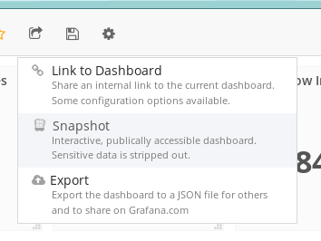
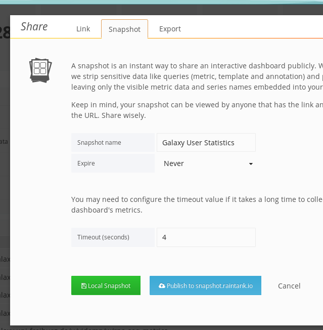
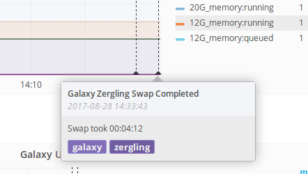

# Operations Manual for usegalaxy.eu

## Adding a User to Grafana

1. They should [login](https://grafana.denbi.uni-freiburg.de/login) using GitHub auth.
    - Note that they must be a member of an [approved organisation](https://github.com/usegalaxy-eu/infrastructure-playbook/blob/39d5b7e86b4f45acba53adb965b11b63700327ad/group_vars/grafana.yml#L119).  (Note that this link is to a specific revision where I could be sure the line number was correct, please check against `master`)
2. (As an admin) Open [the user list](https://grafana.denbi.uni-freiburg.de/admin/users/)
3. Find them and "edit"
4. Under "Organizations" type "Main" and select the main organisation that shows up, adding them as the appropriate role.

## TaaS Groups

1. Create a **role** in Galaxy

   - Must use dashes
   - Must be prefixed with `training-`
   
2. Add users / groups to this role
3. Edit [resources.yaml](https://github.com/usegalaxy-eu/vgcn-infrastructure/blob/master/resources.yaml) and create a section in the yaml file like the example training group.
4. Ensure that the `tag: training-some-training-identifier` in the resources.yaml matches **exactly** to the role name you created in step 1.

## Linking to Grafana Graphs

- First, share the entire dashboad.

  

- You'll want to make a snapshot

  

- And finally use the green button to share it. Beware that if it is a
  data-heavy dashboard (e.g. featuring many large queries), you'll need
  to bump the timeout for fetching data.

  

- Now you can embed individual portions of these graphs.

## Read-only Fridays

- **NO EXCEPTIONS**
- Do not merge things to the playbook repositories that will be auto-applied
- Do not do any manual systems administration
- Consider writing documentation or more test cases instead.

## Updating a Tool

Please either use ephemeris from the command, or the admin interface. In the future this will be replaced completely by just editing the [yaml file](https://github.com/usegalaxy-eu/usegalaxy-eu-tools), but for now please use one of the previous options.

ephermeris method:

```bash
export PATH=/usr/local/tools/_conda/bin/:$PATH
source activate ephemeris
cd /usr/local/galaxy/galaxy-fr-tools
shed-install --name suite_openms --owner galaxyp --section_label 'Proteomics' --api_key $GALAXY_API_KEY --galaxy https://galaxy.uni-freiburg.de
bash fix_conda_env.sh
```

## Adjusting a Tool's Requirements

1. Edit https://github.com/usegalaxy-eu/galaxy-playbook-temporary/blob/master/roles/galaxy_config/templates/job_conf.xml
2. Mirror changes to https://github.com/usegalaxy-eu/galaxy-playbook-temporary/blob/master/roles/galaxy_config/templates/job_conf.py)
3. Wait until the end of the hour, at which the playbook will run. You should be able to confirm this via [grafana](https://grafana.denbi.uni-freiburg.de/dashboard/db/galaxy?refresh=1m&panelId=39&fullscreen&orgId=1)

[An example PR](https://github.com/usegalaxy-eu/galaxy-playbook-temporary/pull/3/files)


## Restarting Galaxy

If you're doing a full restart of the server, use `supervisorctl restart all`
followed by `supervisorctl stop gx:zergling1` as supervisor restart restarts
too much.

Restarting handlers can be done via `supervisorctl restart hd:`, in case
changes are made to job scheduling.

However if you just want to swap the zerglings in use (e.g. for a newly
installed set of tools), then you must use `~/galaxy-dist/restart.sh` which
includes special logic for waiting until the new zergling is alive and then
stopping the old one, because they don't do the magic turning of the other one
off that is described in the galaxy training.

## InfluxDB Events

For administration tasks, sending events to influxdb is a good way to note any potential impacts your actions had on the server. Here's an example bash function:

```bash
function influxdb_event(){
	q=`date +%s`000000000;
	title=$1;
	desc=$2;
	tags=$3;
	curl -i \
		-XPOST \
		'http://influxdb:8086/write?db=rancher' \
		--data-binary "events,dc=rz value=\"$title\",description=\"$desc\",tags=\"$tags\" $q";
}

influxdb_event "testing some events" "with <b>description</b>" "galaxy,testing"
```

These functions are easy to insert anywhere and everywhere and let us make
notes on Grafana about these events. When trying to correlate things like "I
replaced the XML parsing in this service and restarted galaxy" annotated events
can be helpful in seeing the effects downstream.




## Galaxy Upgrading procedures

### 7 days before downtime

- Write an announcment about the Galaxy downtime explaining what is being upgraded. Be sure to link to the release annoucement.

### 1 day before downtime

- Check out the recent Galaxy version locally
- Check out out Galaxy playbook
- Sync `galaxy.ini` and `datatypes_conf.xml` with their respective sample files
- Create a PR with all changes to the playbook


### 1-2 hours before downtime

- Post a message to the Galaxy Frieburg lobby and the galaxy-fr channel

### <1 hour before downtime

Assuming that you plan to start the upgrade procedure at the start of an hour:

- Merge the PR during that hour preceding so that the playbook will run normally at the top of the hour.

### Downtime begins

As root:

- Update `/etc/nginx/conf.d/galaxy.conf` to only allow the person that is updating Galaxy see the Galaxy site, everyone else sees a maintainence page

    A diff like the following works well:
    ```nginx
    - uwsgi_pass      127.0.0.1:4002;
    + uwsgi_pass      127.0.0.1:9002; # Does not exist
    + if ($remote_addr ~* 132.XXX.YYY.ZZZ) {
    +     uwsgi_pass      127.0.0.1:4002;
    + }
    ```

    You can add multiple copies of the if block for your testers.
- `nginx -t`
- `service restart nginx`

Switch to the galaxy user:

- `cd ~/galaxy-dist/`
- `supervisorctl stop gx: hd:`
- Commit any and all remaining local changes to the git repository. You should be on a branch like `release_xx.yy_freiburg`
- Run `git format-patch release_xx.yy` which should produce a set of patches for all of the local changes since the previous release.
- `git fetch origin`
- `git checkout release_aa.bb`, Check out the newest release that you are switching to.
- `git checkout -b release_aa.bb_freiburg`
- Go through the patches you made in the format-patch step, resolving them one-by-one, in order. Delete them as you finish.
- (optional?) We temporarily added `exit 0;` to the top of `~/galaxy-dist/restart.sh` in
  order to allow the playbook to run successfully. Otherwise it was finding
  that both handlers were offline and failing to execute.
- (optional?) Manually ran `galaxy-config/playbook.sh` to apply some more config changes.
- Run `run.sh` to make and database migrations and fetch new wheels, `ctrl-c` once it gets successfully started and says it is listening. Listening may look like:

    ```
    galaxy.tools.search DEBUG 2017-11-08 17:33:50,914 Toolbox index finished (40.040 ms)
    galaxy.queue_worker INFO 2017-11-08 17:33:50,916 Instance 'main' received 'rebuild_toolbox_search_index' task, executing now.
    galaxy.tools.search DEBUG 2017-11-08 17:33:50,916 Starting to build toolbox index.
    galaxy.tools.search DEBUG 2017-11-08 17:33:50,939 Toolbox index finished (22.785 ms)
    ```

At this point the upgrade is done and you need to start testing:

- `supervisorctl start gx: hd:`
- `supervisorctl stop gx:zergling1` Stop the extra zergling, no need for it to even try to boot.
- `gl` to follow galaxy logs
- test features that have changed and ensure they are functional now

Now everything should be working fine and you're ready to start finishing the downtime.

- (as root) undo the nginx configuration that you've done
- (as root) `nginx -t`
- (as root) `service restart nginx` opening Galaxy to everyone again
- Add a blog post about this (an [example](https://github.com/usegalaxy-eu/galaxy-freiburg/pull/82))

## Conda "read only" error on tool run

This happens because the `..checkenv` command in conda actually tries to
symlink some stuff into the conda env. This only works on the head node.

```
Failed to activate conda environment! Error was:
An unexpected error has occurred.
Please consider posting the following information to the
conda GitHub issue tracker at:

    https://github.com/conda/conda/issues


Current conda install:

               platform : linux-64
          conda version : 4.2.13
       conda is private : False
      conda-env version : 4.2.13
    conda-build version : not installed
         python version : 3.5.2.final.0
       requests version : 2.11.1
       root environment : /usr/local/tools/_conda  (read only)
    default environment : /usr/local/tools/_conda
       envs directories : /usr/local/galaxy/.conda/envs
                          /usr/local/tools/_conda/envs
          package cache : /usr/local/galaxy/.conda/envs/.pkgs
                          /usr/local/tools/_conda/pkgs
           channel URLs : https://conda.anaconda.org/iuc/linux-64
                          https://conda.anaconda.org/iuc/noarch
                          https://conda.anaconda.org/bioconda/linux-64
                          https://conda.anaconda.org/bioconda/noarch
                          https://conda.anaconda.org/r/linux-64
                          https://conda.anaconda.org/r/noarch
                          https://repo.continuum.io/pkgs/free/linux-64
                          https://repo.continuum.io/pkgs/free/noarch
                          https://repo.continuum.io/pkgs/pro/linux-64
                          https://repo.continuum.io/pkgs/pro/noarch
                          https://conda.anaconda.org/conda-forge/linux-64
                          https://conda.anaconda.org/conda-forge/noarch
                          https://conda.anaconda.org/bgruening/linux-64
                          https://conda.anaconda.org/bgruening/noarch
            config file : /usr/local/galaxy/.condarc
           offline mode : False


`$ /usr/local/tools/_conda/bin/conda ..checkenv bash /usr/local/tools/_conda/envs/__disco@1.2`


    Traceback (most recent call last):
      File "/usr/local/tools/_conda/lib/python3.5/site-packages/conda/exceptions.py", line 479, in conda_exception_handler
        return_value = func(*args, **kwargs)
      File "/usr/local/tools/_conda/lib/python3.5/site-packages/conda/cli/main.py", line 94, in _main
        activate.main()
      File "/usr/local/tools/_conda/lib/python3.5/site-packages/conda/cli/activate.py", line 148, in main
        conda.install.symlink_conda(prefix, context.root_dir, shell)
      File "/usr/local/tools/_conda/lib/python3.5/site-packages/conda/install.py", line 541, in symlink_conda
        symlink_conda_hlp(prefix, root_dir, where, symlink_fn)
      File "/usr/local/tools/_conda/lib/python3.5/site-packages/conda/install.py", line 558, in symlink_conda_hlp
        symlink_fn(root_file, prefix_file)
    OSError: [Errno 30] Read-only file system: '/usr/local/tools/_conda/bin/conda' -> '/usr/local/tools/_conda/envs/__disco@1.2/bin/conda'
```


The resolution for this is to `..checkenv` on `cn029`.

```bash

#!/bin/bash
for i in `find /usr/local/tools/_conda/envs/ -mindepth 1 -maxdepth 1 -type d`;
do
    if [ ! -f $i/bin/conda ]; then
        echo "$i missing /bin/conda -- fixing;"
        /usr/local/tools/_conda/bin/conda ..checkenv bash $i
    fi
done
```
